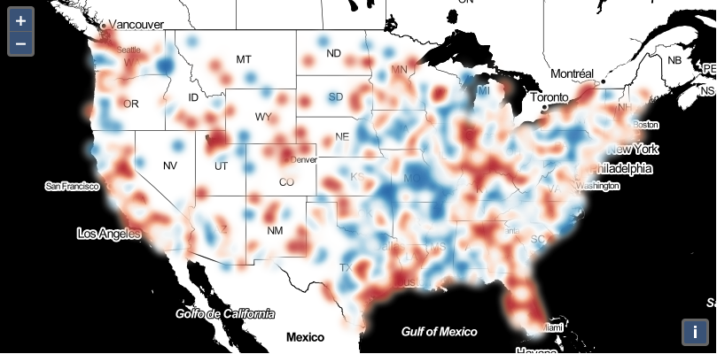

# Hilomap - A Heatmap Layer for Visualizing Both Low and High Trends

When an analyst wants to study population change in major cities in the United States, population decrease may be as important as population increase. When we look at climate change measures, such as temperature, extremely low and extremely high observations are more important than average ones. When a conventional heatmap is generated from such data, however, low extremes are overridden by high extremes due to the cumulative density effect. For visualizing such change data with both low and high extremes, there are two requirements that a conventional heatmap does not satisfy: 1) On a color gradient that changes from low to neutral to high, both the low end and the high end data should be highlighted; and 2) When a circle with high weight overlaps with another one with low weight, the aggregated weight should neutralize and the coloring should stay around the middle of the color gradient, instead of toward the high end.



One may suggest to create two heatmap layers, one for high and the other for low (using an inverted color gradient from neutral to low), and load them in a map. However, this option is ineffective because of the visual interference to the bottom layer from the transparency of the top layer.

Hilomap is a reference implementation of a HTML5 canvas-based vector layer that hilights both low and high trends. Hilomap is based on OpenLayers 5.3.3 and should work for 5.x. OpenLayers 6+ uses WebGL, instead. The implementation is inspired by the direct point overlay method in  [LeafLet simpleheat](https://github.com/mourner/simpleheat/blob/gh-pages/simpleheat.js) and [OpenLayers 5.3.3 Heatmap](https://github.com/openlayers/openlayers/blob/272a3c6b11804f2721a0f3fef545d91d6ddf90b1/src/ol/layer/Heatmap.js) and the coarsened grid interpolation (indirect point overlay) method in [Leaflet.heat](https://github.com/Leaflet/Leaflet.heat/blob/gh-pages/src/HeatLayer.js). 

## Installation

Install `nodejs` in `conda`:
```bash
conda create -yn nodejs nodejs
conda activate nodejs
```

Download OpenLayers v5.3.3 from [here](https://github.com/openlayers/openlayers/releases/tag/v5.3.3).

On Mac OS, do the following to make `npm` work:
```bash
export PATH=/usr/bin:$PATH
export LD_LIBRARY_PATH=/usr/lib:$LD_LIBRARY_PATH
```

Go to OpenLayers directory, and:
```bash
npm install
```

Now install `hilomap`. Suppose HILODIR is where you download `hilomap`:
```bash
# copy source files and examples
cp HILODIR/src/ol/layer.js src/ol/ # add hilomap to layer list
cp HILODIR/src/ol/layer/Hilomap.js src/ol/layer/
cp HILODIR/examples/hilomap.* examples/
cp HILODIR/examples/data/kml/uscities_sample.kml examples/
# compile
npm run build-package && npm run build-examples
```

The `hilomap` example can then be loaded in browser: https://HOST/OLPATH/build/examples/hilomap.html .


